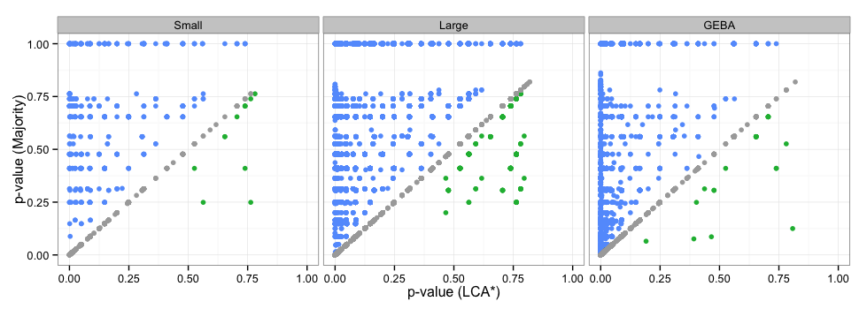
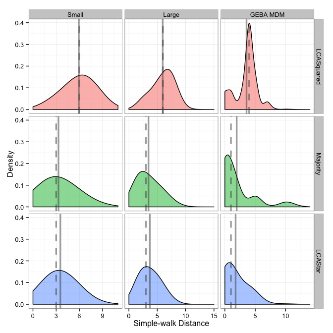
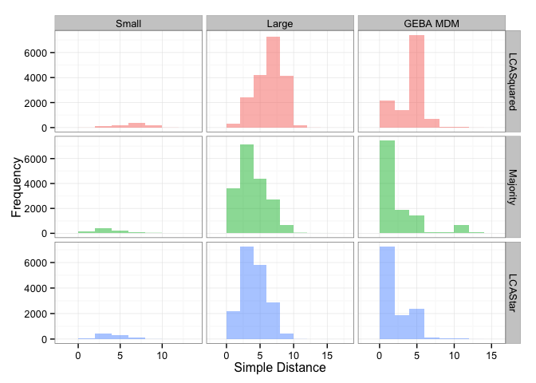
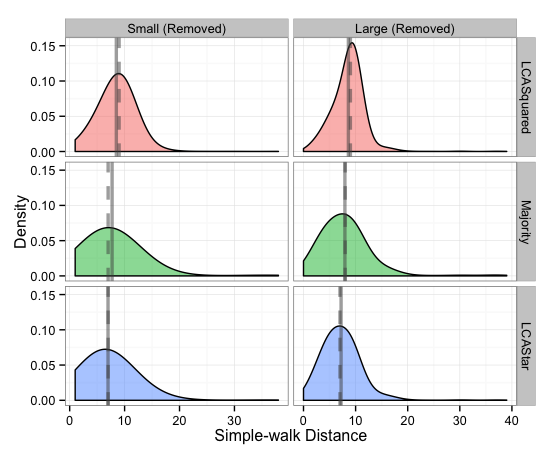
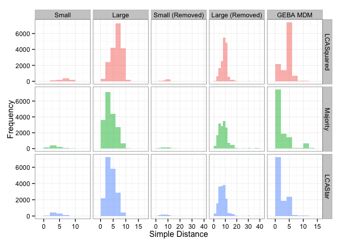

# LCA Star Methods
Niels W. Hanson  
Friday, November 28, 2014  


# Preample

* load required R packages


```r
require(ggplot2)
require(reshape2)
require(dplyr)
theme_set(theme_bw()) # set theme and font
```

# Overview

This document summarizes the analysis performed in "LCA*: an entropy-based measure for taxonomic assignment within assembled metagenomes" describing the use of the simulation the Small and Large metagenomes from a coolection of genomes downloaded from the NCBI, the running of the MetaPathways pipeline  [[@Konwar:2013cw], [@Hanson2014]], use of the `LCAStar.py` python module for the calculation of the LCAStar, Simple Majority, LCA^2 taxonomic estimation methods. 

Each simulation had its ORFs predicted and annotated against the RefSeq database using the MetaPathways pipeline. The original source of each contig was predicted from the taxonomic annotations ascribed to each LCA-predicted ORF using three different methods: $LCA^2$, $Simple Majority$, and our information-theoretic LCAStar. LCA^2 simply applies the LCA algorithm again to the set of ORF taxonomies. The $Simple Majority$ method ascribes the taxonomy of the contig to the taxonomy that has the greatest majority. Our $LCA*$ method applies the information-theoetic result and algorithm previously described with a majority theshold set to the default majority ($\alpha=0.5$).

We evaluated the performance of these predictions using two taxonomic distances on the NCBI taxonomy tree. First a simple walk on the NCBI Taxonomy Hierarchy from the observed predicted taxonomy to the original expected taxonomy. The second is a weighted taxonomic distance that weightes each edge proportional to $\frac{1}{d}$ where $d$ is the depth of the edge in the tree (see [[@Hanson2014]]) for more details. The NCBI Taxonomy Hierarchy was modified with the additional *prokaryotes* node as a parent of *Bacteria* and *Archaea* nodes.

# Simulation

Two simulated metagenomes were created, Small Large, using 10,000bp contigs, randomly sampled from a collection of 2713 genomes obtained from the NCBI (Downloaded March 15 2014 <ftp://ftp.ncbi.nlm.nih.gov/pub/taxonomy/>) using the python script `subsample_ncbi.py`. The first simulation, Small, is a smaller sample of 100 genomes, sampling 10 random reads from each genome. The second simulation, Large, samples a random subset of 2,000 genomes, sampling 10 random reads from each genome.

## Obtaining NCBI Genomes

* Downloaded `all.fna.tar.gz` and `summary.txt` from the NCBI's ftp server: <ftp://ftp.ncbi.nlm.nih.gov/genomes/> Mar 12, 2014
* `summary.txt` contains some metadata for a number of these genomes:

```
Accession  GenbankAcc  Length	Taxid	ProjectID	TaxName	Replicon	Create Date	Update_Date
NC_000907.1	L42023.1	1830138	71421	57771	Haemophilus influenzae Rd KW20	chromosome 	Oct 19 2001	Sep 11 2013  4:30:20:076PM
```

```
cat summary.txt  | awk '{print $1}' > u
for s in `cat u`; do var1=`find . -name *${s%.[0-9]}*`; echo $s$'\t'$var1 >> ncbiID_to_file; done
```

* `summary.txt` is a fairly comprehensive list, but 25 genomes were dropped because they were not found in the `summary.txt` metadata file

```
grep --perl-regexp "\t$" ncbiID_to_file | wc
      25      25     324
grep --perl-regexp "\t$" ncbiID_to_file | wc
NC_003911.11  
AC_000091.1	
NC_009353.1	
NC_009444.1	
NC_010332.1	
NS_000190.1	
NC_011980.1	
NS_000196.1	
NS_000197.2	
NC_012627.1	
NC_012629.1	
NC_012630.1	
NC_012915.1	
NC_013416.1	
NC_013438.1	
NC_013597.1	
NC_013784.1	
NC_013785.1	
NC_013786.1	
NC_013787.1	
NC_013788.1	
NC_014629.1	
NC_015557.1	
NC_015587.1
```

* this leaves a total of 2617 genomes in `ncbiID_to_file.txt`, which maps the NCBI IDs to the .fna file location

```
grep --perl-regexp ".*fna" ncbiID_to_file | wc
    2617    5234  197129
wc ncbiID_to_file
    2642    5259  197453 ncbiID_to_file
grep --perl-regexp ".*fna" ncbiID_to_file > ncbiID_to_file.txt
```

## Simulation

Wrote my own script `subsample_ncbi.py` to quickly sample from a collection of fasta files specified in our `ncbiID_to_file.txt` that we created above. We use this to compute the `test1` or Small and `test2` or Larger simulated metagenomes.

### Small simulation

Here we create the `test1` or Small simulation as it is referred to in the text. This script creates sub-sequences of length 10,000, sampling 10 sequences per file on a random subset of 100 (the random number generator is seeded so that results can be reproducible)

```
python subsample_ncbi.py -i ncbiID_to_file.txt -l 10000 -s 10 -n 100 -o lca_star_test1.fasta
```

Creating our Small simulated contigs file: `lca_star_test1.fasta`

### Large simulation

For a second test we sampled sequences of 10,000 bps using 10 subsamples from 2000 randomly selected genomes. Here, did the same procedure except with significantly more samples.

```
python subsample_ncbi.py -i ncbiID_to_file.txt -o lca_test2.fasta -l 10000 -s 10 -n 2000
```

Creating our Large simulated contigs file: `lca_star_test1.fasta`

# GEBA SAGs

The 201 Single-cell amplified genome (SAG) microbial dark matter assembies were obtained from <https://img.jgi.doe.gov> under the Study Name `GEBA-MDM` [[@Rinke]]. Combined assemblies were excluded from this analysis.

# MetaPathways Annotation

The Small, Large, and 201 MDM SAG assemblies were annotated against the RefSeq v62 via MetaPathways v2.0 pipeline [REF] using standard quality control settings and the LAST homology search algorithm [REF].

The outputs of these runs can be found in:


# Running LCAStar


# Analysis of LCAStar Results

* Read and merge the three datasets


```r
colClasses <- c("character", "character", "numeric", "numeric", "numeric",
                "character", "numeric", "numeric", "numeric", 
                "character", "numeric", "numeric", "character" )
test1_df <- read.table("test1_lcastar.txt", sep="\t", header=T, na.strings = "None", 
                      colClasses = colClasses, strip.white=TRUE, quote="")
test2_df <- read.table("test2_lcastar.txt", sep="\t", header=T, na.strings = "None", 
                      colClasses = colClasses, strip.white=TRUE, quote="")
geba_df <- read.table("GEBA_SAG_all_lcastar.txt", sep="\t", header=T, na.strings = "None", 
                      colClasses = colClasses, strip.white=TRUE, quote="")

all_df <- rbind(cbind(geba_df, Sample="GEBA"),cbind(test1_df, Sample="Small"),cbind(test2_df, Sample="Large"))

all_df$Sample <- factor(all_df$Sample, levels=c("Small", "Large", "GEBA"))
```

* compare p-value calculations between the Majority and LCA* methods


```r
# p-value compare
g1 <- ggplot(all_df, aes(x=LCAStar_p, y=Majority_p)) 
g1 <- g1 + geom_point(data = subset(all_df, LCAStar_p > Majority_p), color="#1BB840")
g1 <- g1 + geom_point(data = subset(all_df, LCAStar_p < Majority_p), color="#649EFC")
g1 <- g1 + geom_point(data = subset(all_df, LCAStar_p == Majority_p), color="darkgrey")
g1 <- g1 + xlim(0,1)
g1 <- g1 + ylim(0,1)
g1 <- g1 + xlab("p-value (LCA*)")
g1 <- g1 + ylab("p-value (Majority)")
g1 <- g1 + facet_wrap(~ Sample)
g1 <- g1 + theme(legend.position="none")
g1
```

 

```r
pdf(file = "pdfs/fig1.pdf", width = 10.2, height=3.65)
g1
dev.off()
```

```
## quartz_off_screen 
##                 2
```

**Figure 1:** Comparing p-values of taxonomic voting statistics Majority and LCA*.

Notes:

* all three samples exhibit the same pattern, suggesting that the simulation procecture is producing representative results at least in terms of the LCA* and Majority summary statistics 
* in many cases the simple Majority and LCA* solutions are the same, as shown by the strong linear trend
* when in disagreement LCA* has more favorable (lower) p-values than the simple majority, in many cases the p-value of the LCA* solution is significantly smaller than the simple majority one
* disagreements where $p_{Majority} < p_{LCA^*}$ occur when the LCA* transformation widens the difference between the first and second place leaders, although this is a bit of a corner case, and happens fairly infrequently
* the majority has a degenerate case where there is as tie in the $M = X_n$, which is a degenerate case, meaning that the Simple majority had to make an arbitary choise between two or more taxonomic candidates
* Suggests that if you subscribe to the p-value argument, LCA* produces more reliable results, although one can argue that his happens by construction.

Function to format and reshape data for ggplot:


```r
clean_up_data2 <- function(df) {
  new_df <-rbind(cbind(df$Contig, df$LCAStar, "LCAStar", df$Original, df$LCAStar_p, df$LCAStar_dist, df$LCAStar_WTD),
           cbind(df$Contig, df$Majority, "Majority", df$Original, df$Majority_p, df$Majority_dist, df$Majority_WTD),
           cbind(df$Contig, df$LCASquared, "LCASquared", df$Original, NA, df$LCASquared_dist, df$LCASquared_WTD))
  new_df <- as.data.frame(new_df)
  colnames(new_df) <- c("Contig", "Taxonomy", "Method", "Original", "p-value", "Walk", "WTD")
  new_df.m<- melt(new_df, id.vars = c("Contig", "Taxonomy", "Method", "Original"))
  new_df.m$value <- as.numeric(as.character(new_df.m$value))
  new_df.m$Method <- factor(new_df.m$Method, levels = c("LCASquared", "Majority", "LCAStar"))
  new_df.m
}
```


```r
# reshape data into ggplot form
test1_df.m <- clean_up_data2(test1_df)
test1_df.m<- cbind(test1_df.m, Sample="Small")
test2_df.m <- clean_up_data2(test2_df)
test2_df.m <- cbind(test2_df.m, Sample="Large")
geba_df.m <- clean_up_data2(geba_df)
geba_df.m <- cbind(geba_df.m, Sample="GEBA")

all_df.m <- rbind(test1_df.m, test2_df.m, geba_df.m)
```

* plot the distribution of distances between predictions and taxonomic origin


```r
# plotting parameters
my_line_col = "#4C4C4C"
line_size = 1.2
alpha_val = 0.5

walk_means <- select(all_df.m, Method, Sample, variable, value) %>%
  group_by(Method, Sample, variable) %>%
  filter(variable== "Walk") %>%
  summarize(mean=mean(value, na.rm = T),
            percent_25 = quantile(value, probs = 0.25, na.rm = T),
            median = quantile(value, probs=0.5, na.rm = T),
            percent_75 = quantile(value, probs = 0.75, na.rm = T))

g2 <- ggplot(subset(all_df.m, variable == "Walk"), aes(x=value, fill=Method))
# g2 <- g2 + geom_histogram(binwidth=2, alpha=0.8) 
g2 <- g2 + geom_density(adjust=5, alpha=alpha_val) 
g2 <- g2 + facet_grid(Method ~ Sample, scales = "free_x")
g2 <- g2 + theme(legend.position="none")
g2 <- g2 + geom_vline(aes(xintercept=mean), colour=my_line_col, size=line_size, alpha=alpha_val, walk_means)
g2 <- g2 + geom_vline(aes(xintercept=median), colour=my_line_col, linetype="dashed", size=line_size, alpha=alpha_val, walk_means)
g2 <- g2 + xlab("Simple-walk Distance")
g2 <- g2 + ylab("Density")
g2
```

 

```r
pdf(file = "pdfs/fig2.pdf", width = 7, height=7)
g2
dev.off()
```

```
## quartz_off_screen 
##                 2
```

**Figure 2:** Distribution of simple-walk distances of taxonomic predictions to contig origin: LCASquared, Majority, LCA*. Kernel densities for error distances from each of the three prediction methods on the two simluated and GEBA datasets.

Notes:

* In all cases, LCASquared perfomed on-aggregate more poorly than the voting-based methods, Majority and LCAStar.
   * Means and Medians of predicted distances for LCASqared were consistently larger
* LCA* and Majority by large performed very simmialrly in terms of distance from the target taxon, in fact in many cases they are one and the same when no entropy-based transformations need to occur
   * Majority method has a slightly longer tail in the GEBA sample
   * medians are identical in all samples, better measure in slightly skewed distribution
* Simple-walk distance is a crude measure of taxonomic distance


Same thing again, expect using the weighted taxonomic distance.


```r
means <- select(all_df.m, Method, Sample, variable, value) %>%
  group_by(Method, Sample, variable) %>%
  filter(variable== "WTD") %>%
  summarize(mean=mean(value, na.rm = T),
            percent_25 = quantile(value, probs = 0.25, na.rm = T),
            median = quantile(value, probs=0.5, na.rm = T),
            percent_75 = quantile(value, probs = 0.75, na.rm = T))

g3 <- ggplot(subset(all_df.m, variable == "WTD"), aes(x=value, fill=Method))
g3 <- g3 + geom_density(adjust=20, alpha=0.6) 
g3 <- g3 + facet_grid(Method ~ Sample, scales = "free_y")
g3 <- g3 + theme(legend.position="none")
g3 <- g3 + geom_vline(aes(xintercept=mean), colour=my_line_col, size=1.5, alpha=0.5, means)
g3 <- g3 + geom_vline(aes(xintercept=median), colour=my_line_col, linetype="dashed", size=1.5, alpha=0.5, means)
g3 <- g3 + xlab("Weighted Taxonomic Distance")
g3 <- g3 + ylab("Density")
g3
```

 

```r
pdf(file = "pdfs/fig3.pdf", width = 7, height=7)
g3
dev.off()
```

```
## quartz_off_screen 
##                 2
```

**Figure 3:** Distribution of WTD distances of taxonomic predictions to contig origin: LCASquared, Majority, LCA*. Kernel densities for error distances from each of the three prediction methods on the two simluated and GEBA datasets.

Notes:

* distance punishes divergent predictions more than in-lineage predictions
* LCA* and Majority methods again consistently performed better than LCASquared, although difference is not as extreme as by definition LCASquared will have to predict a common ancestor to all electorate
* LCASquared occassionally has an exetremely large tail of 'root' predictions
* Voting based methods have essentially identical median and average
    * Majority in GEBA sample has slightly shorter tail


Treating the whole thing as a regression problem we have the following global averages.


```r
# function for RMSE
rmse <- function(x) {
  sqrt(mean(x^2, na.rm = T))
}

ci <- function(x, sig=0.05) {
  
  x <- x[!is.na(x)] # remove NA
  x <- x^2 # squre
  N <- length(x)
  x_sd <- sd(x, na.rm=TRUE)
  
  x_se <- x_sd / sqrt(N)
  x_se <- sqrt(x_se)
  ciMult <- qt((1-sig)/2 + .5, N-1)
  x_ci <- x_se * ciMult
  x_ci
}

# function to compute standard errors
summarySE <- function(data=NULL, measurevar, groupvars=NULL, na.rm=FALSE,
                      conf.interval=.95, .drop=TRUE) {
    require(plyr)

    # New version of length which can handle NA's: if na.rm==T, don't count them
    length2 <- function (x, na.rm=FALSE) {
        if (na.rm) sum(!is.na(x))
        else       length(x)
    }

    # This does the summary. For each group's data frame, return a vector with
    # N, mean, and sd
    datac <- ddply(data, groupvars, .drop=.drop,
      .fun = function(xx, col) {
        c(N    = length2(xx[[col]], na.rm=na.rm),
          mean = mean   (xx[[col]], na.rm=na.rm),
          sd   = sd     (xx[[col]], na.rm=na.rm)
        )
      },
      measurevar
    )

    # Rename the "mean" column    
    datac <- rename(datac, c("mean" = measurevar))

    datac$se <- datac$sd / sqrt(datac$N)  # Calculate standard error of the mean

    # Confidence interval multiplier for standard error
    # Calculate t-statistic for confidence interval: 
    # e.g., if conf.interval is .95, use .975 (above/below), and use df=N-1
    ciMult <- qt(conf.interval/2 + .5, datac$N-1)
    datac$ci <- datac$se * ciMult

    return(datac)
}

res <- select(all_df.m, Method, Sample, variable, value) %>%
       filter(variable %in% c("Walk", "WTD")) %>%
       group_by(Method, Sample, variable) %>%
       summarize(n_obs = n(), RMSE = rmse(value), sd=sd(value, na.rm=TRUE),ci=ci(value, sig=0.05), na.rm=TRUE)
g4 <- ggplot(res, aes(y=RMSE, x =Method, fill=Method)) 
g4 <- g4 + geom_bar(stat="identity", alpha=0.7) 
g4 <- g4 + facet_grid(variable~Sample, scales="free_y")
g4 <- g4 + theme(legend.position="none")
g4 <- g4 + geom_errorbar(aes(ymin=RMSE-ci, ymax=RMSE+ci), width=.1)
g4
```

 

```r
pdf(file = "pdfs/fig4.pdf", width = 5.49, height=4.43)
g4
dev.off()
```

```
## quartz_off_screen 
##                 2
```

**Figure 4:** RMSE Values for our prediction errors in the simple Walk and WTD.


```r
means <- select(all_df.m, Method, Sample, variable, value) %>%
  filter(variable== "p-value" & Method %in% c("Majority", "LCAStar")) %>%
  group_by(Method, Sample, variable) %>%
  summarize(mean=mean(value, na.rm = T),
            percent_25 = quantile(value, probs = 0.25, na.rm = T),
            median = quantile(value, probs=0.5, na.rm = T),
            percent_75 = quantile(value, probs = 0.75, na.rm = T))

g5 <- ggplot(subset(all_df.m, variable == "p-value" & Method %in% c("Majority", "LCAStar")), aes(x=value, fill=Method)) 
g5 <- g5 + geom_density(adjust=5, alpha=alpha_val)
g5 <- g5 + facet_grid(Method~Sample)
g5 <- g5 + xlab("p-value")
g5 <- g5 + ylab("Density")
g5 <- g5 + geom_vline(aes(xintercept=median), colour=my_line_col, linetype="dashed", size=line_size, alpha=alpha_val, means)
g5 <- g5 + geom_vline(aes(xintercept=mean), colour=my_line_col, size=line_size, alpha=alpha_val, means)
g5 <- g5 + scale_fill_manual(values=c("#1BB840", "#649EFC"))
g5 <- g5 + theme(legend.position="none")
g5
```

 

```r
pdf(file = "pdfs/fig5.pdf", width = 8.77, height=6.897)
g5
dev.off()
```

```
## quartz_off_screen 
##                 2
```

**Figure 5:** p-value distribution of the Majority and LCA* predictions.


## References

